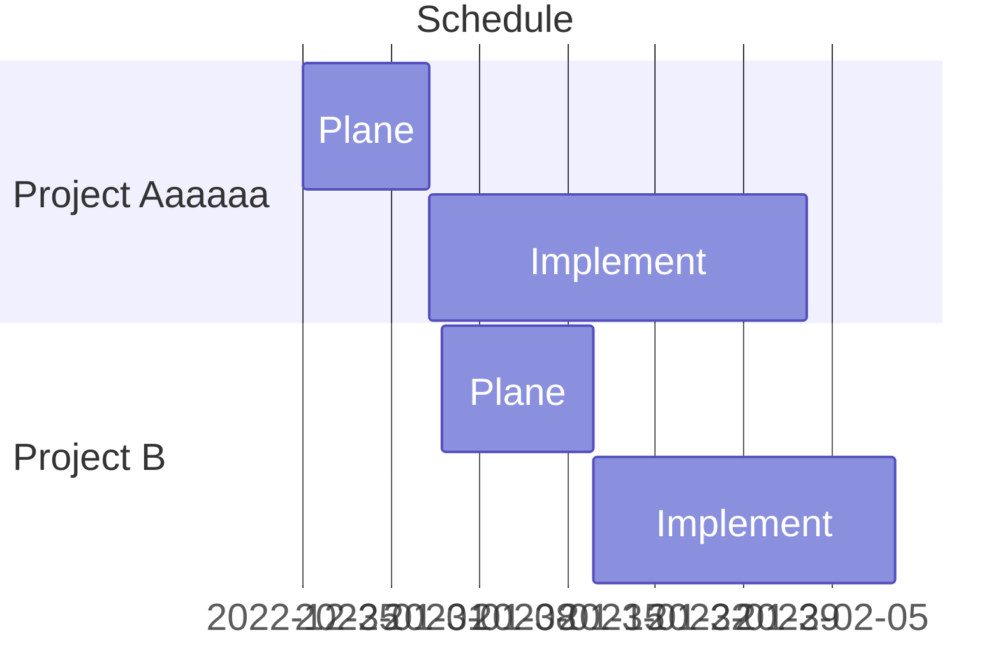
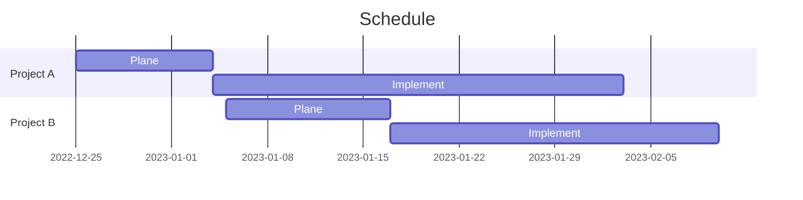

```mermaid
%%{
  init: {
    'themeCSS': 'text { font-size: 30px !important; }',
    'gantt': {
        'barHeight': 100,
        'leftPadding': 240,
        'fontSize': 30
    }
  }
}%%
gantt
    title Schedule
    dateFormat  YYYY-MM-DD

    section Project Aaaaaa
        Plane       :a, 2022-12-25, 10d
        Implement   :b, after a, 30d
    section Project B
        Plane       :c, 2023-01-05, 12d
        Implement   :d, after c, 24d
```

```mermaid
gantt
    title Schedule
    dateFormat  YYYY-MM-DD

    section Project A
        Plane       :a, 2022-12-25, 10d
        Implement   :b, after a, 30d
    section Project B
        Plane       :c, 2023-01-05, 12d
        Implement   :d, after c, 24d
```